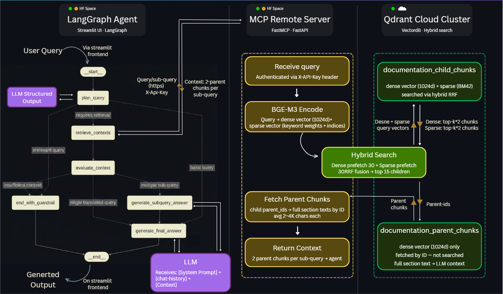

<div align="center">

# 🦜 LangChain RAG Assistant

**Ask anything about LangChain, LangGraph, LangSmith, or DeepAgents — get grounded answers with code examples.**

[](https://python.org)
[](https://langchain-ai.github.io/langgraph)
[](https://qdrant.tech)
[](https://huggingface.co/spaces)
[](https://docs.ragas.io)

</div>

---

## What it does

Indexes the entire official LangChain documentation ecosystem into a hybrid vector database and exposes it through a multi-step LangGraph agent that plans, retrieves, and synthesizes answers — not just keyword matches. Custom chunking used to retain docs code-blocks & tables neatly. Deployed links:<br>
[App link 🦜](https://huggingface.co/spaces/Rushank/LangGraph-RAG-Agent) <br>
[MCP Server 🤗](https://huggingface.co/spaces/Rushank/langchain-rag-mcp-server/tree/main) <br>
[Qdrant Cloud Cluster ☁](https://a0303a21-3a71-4b02-9a89-e87030c451ab.us-east4-0.gcp.cloud.qdrant.io:6333/dashboard#/collections) <br>
[Eval Results Dashboard 📊](https://rag-for-langchain-official-docs.onrender.com)

---

## How it works



---

## Architecture decisions

| Decision | Choice | Why |
|---|---|---|
| **Chunking** | Parent-child hierarchy | Children give precise retrieval hits. Parents give LLM rich context. One chunk size forces a tradeoff — two sizes don't. |
| **Embedding** | BGE-M3 | Single model for both dense semantic vectors and sparse keyword vectors. Handles code + technical terms well. 8,192 token input limit covers full doc sections. |
| **Search** | Hybrid (dense + sparse) via RRF | Dense alone misses exact class names. Sparse alone misses semantic queries. RRF fusion gets the best from both. |
| **Vector DB** | Qdrant | Native hybrid search, Rust-speed, metadata filtering, free cloud tier, portable storage files. |
| **Agent** | LangGraph | Clean map-reduce pattern for parallel sub-query retrieval. Conditional routing without spaghetti if/else. LangSmith tracing out of the box. |
| **LLM** | Gemini 3.1 Flash Lite | 500 free req/day, 1M token context, Jan 2026 training cutoff — most current LangChain knowledge. |

---

## Project structure

```
├── src/
│   ├── chunk-pipeline/          # MDX → structured chunks (parser.py, run_parser.py)
│   └── indexing-pipeline/       # Colab notebook: embed + upload to Qdrant
│
├── dB-maintenance/
│   ├── chunks_diff.py           # Diffs old vs new chunks → addition + removal lists
│   └── upsert_dB.py             # Syncs local Qdrant → Qdrant Cloud (patch or full rebuild)
│
├── hf-space/                    # 🤗 Deployed: FastAPI + FastMCP retrieval server
│   ├── server.py                # MCP tool endpoint with auth middleware
│   ├── retrieval_pipeline.py    # BGE-M3 embed → hybrid search → parent fetch
│   └── Dockerfile
│
├── langgraph-workflow/          # 🤗 Deployed: Streamlit + LangGraph agent
│   ├── agent.py                 # Graph: plan → retrieve → map → reduce → answer
│   ├── agent_contents/          # utilities, graphs and schemas
│   ├── streamlit_contents/      # streamlit app working
│   ├── app.py                   # Streamlit chat UI
│   └── Dockerfile
│
├── evaluations/                 # 📊 RAGAS synthetic eval: dataset gen + pipeline + dashboard
│   ├── eval-data-generation.ipynb   # KG build → QA synthesis → golden_dataset.json (Kaggle)
│   ├── get_agent_responses.py       # Run agent to get responses
│   ├── eval-pipeline.ipynb          # Agent response categorization + RAGAS scoring (Kaggle)
│   ├── dashboard/
│   │   ├── app.py                   # Flask backend serving 4 API endpoints
│   │   └── templates/index.html     # D3.js single-page results dashboard
│   └── data/
│       ├── golden_dataset.json          # 147 RAGAS-generated QA pairs
│       ├── results.jsonl                # Agent responses + retrieval metadata
│       ├── retrieval_scores_checkpoint.jsonl  # Per-sample RAGAS scores
│       └── knowledge_graph.json         # RAGAS KG: nodes, edges, summaries, entities
│
├── bin/                         # Shell scripts: data_pull.sh, chunking.sh, upsert_dB.sh
└── docker/                      # Local Qdrant via Docker Compose
```

---

## Retrieval pipeline (in detail)

```
Query: "How do I add memory to a LangGraph agent?"
    │
    ▼  BGE-M3 encodes into:
    ├─ dense vector  [0.02, -0.31, 0.88, ...]  (1024 floats — semantic meaning)
    └─ sparse vector {token_47: 0.21, token_1830: 0.63, ...}  (keyword weights)
    │
    ▼  Qdrant hybrid search
    ├─ dense prefetch:  top 30 children by cosine similarity
    ├─ sparse prefetch: top 30 children by keyword overlap
    └─ RRF fusion:      rewards chunks ranking high in BOTH → top 15 children
    │
    ▼  Extract unique parent_ids from top 15 children
    │
    ▼  Fetch parent chunks by ID  (full doc sections, ~2-4K chars each)
    │
    ▼  Return to LangGraph agent for synthesis
```

---

## RAGAS Evaluation

A synthetic golden dataset of 147 QA pairs was generated from the same documentation the agent indexes, then used to evaluate the full agent end-to-end. Because questions are grounded in the agent's own docs, any refusal or wrong answer is a genuine failure.

**How it was built:** 250 documentation chunks were fed into RAGAS's `KnowledgeGraph` builder \running on Kaggle 2×T4 with Qwen 2.5 32B via Ollama. Two synthesizers produced 147 QA pairs: 60% single-hop, 40% multi-hop. The agent was then run on all 147 questions locally, and scored on Kaggle using Command-R 35B as the RAGAS judge — chosen because it's purpose-built for RAG grounding tasks.

Results are split into three buckets: samples where retrieval was performed (117), no-retrieval answers the agent gave anyway (4), and guardrail refusals (24, counted as score=0).

### Results

| Metric | Score | Note |
|---|---|---|
| **Faithfulness** | **0.79** | 79% of agent claims grounded in retrieved context |
| **Context Recall** | **0.77** | Retrieval covers 77% of reference answer content |
| **Answer Correctness** | **0.53** | Gap is retrieval depth, not generation quality — agent faithfully summarises what it retrieves |


## Running locally

**Prerequisites:** Docker Desktop, `uv`, API keys in `langgraph-workflow/.env`

```bash
# 1. Start the agent
uv run --with streamlit streamlit run langgraph-workflow/app.py
# → http://localhost:8501

# 2. (Optional) Start the eval dashboard
cd evaluations/dashboard
pip install flask
python app.py
# → http://localhost:5050
```

**Updating the index** when LangChain docs change:

```bash
bin/data_pull.sh          # pull latest docs
bin/chunking.sh           # rechunk + diff against previous version
# → upload addition_*.json to Colab indexing notebook
# → download qdrant_storage.zip → place in data/
bin/upsert_dB.sh          # patch Qdrant Cloud with only changed chunks
```

---

## Deployment

Two HF Spaces, each auto-deployed via GitHub Actions on push:

| Space | What it runs | Trigger |
|---|---|---|
| `hf-space/` | FastMCP retrieval server (FastAPI, port 7860) | changes to `hf-space/` |
| `langgraph-workflow/` | Streamlit agent UI (port 8501) | changes to `langgraph-workflow/` |